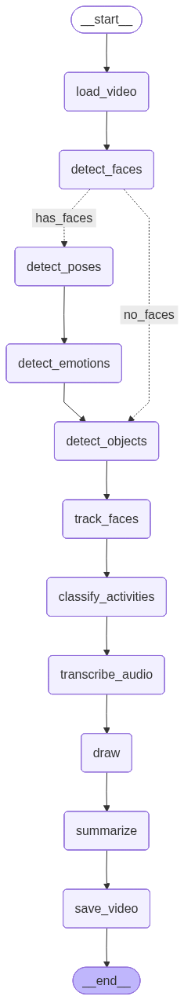

# EmoAct

Sistema de análise de vídeo para detecção de emoções, atividades e identificação de pessoas, com geração automática de sumário por LLM.

## Visão Geral

O EmoAct processa vídeos através de um pipeline modular que extrai múltiplas camadas de informação: detecção facial, reconhecimento de emoções, estimativa de pose corporal, detecção de objetos, transcrição de áudio e classificação de atividades. Ao final, um modelo de linguagem (LLM) gera um resumo narrativo do conteúdo analisado.

## Arquitetura

O sistema utiliza um grafo de estados (StateGraph do LangGraph) para orquestrar o fluxo de processamento:



## Módulos e Funcionalidades

### Entrada/Saída de Vídeo ([video_io.py](emoact/video_io.py))
Gerencia o ciclo de vida do vídeo utilizando OpenCV. A função `load_video()` decompõe o arquivo em frames NumPy e captura o FPS original, retornando ambos como tupla. Já `save_video()` reconstrói o vídeo a partir dos frames processados, configurando automaticamente o codec MP4V e garantindo que as dimensões e taxa de frames sejam preservadas. Inclui validação robusta de abertura de arquivos para evitar falhas silenciosas.

### Detecção Facial ([face.py](emoact/face.py))
Integra o **InsightFace** com aceleração CUDA (modelo Buffalo_L) para análise facial completa. A função `detect_faces()` retorna tuplas contendo coordenadas de bounding box em formato `(left, top, right, bottom)`, embedding de 512 dimensões, confiança da detecção, gênero (0=feminino, 1=masculino) e idade estimada. O modelo é inicializado com resolução de detecção de 640×640 pixels. Implementa supressão de output para evitar logs verbosos durante o carregamento. O threshold padrão de confiança é 0.5, filtrando detecções ambíguas.

### Reconhecimento de Emoções ([emotions.py](emoact/emotions.py))
Emprega o transformer `dima806/facial_emotions_image_detection` via HuggingFace para análise afetiva. A função `detect_emotion()` processa a imagem recortada da face através do `AutoImageProcessor`, executa inferência com PyTorch (com suporte a GPU) e retorna o rótulo da emoção predita usando mapeamento `id2label`. Funciona em modo de inferência (`torch.no_grad()`) para otimizar memória. Detecta emoções como alegria, tristeza, raiva, medo, surpresa, desgosto e neutro.

### Estimativa de Pose ([pose.py](emoact/pose.py))
Utiliza **YOLOv11n-pose** para detecção de 17 keypoints corporais no padrão COCO (incluindo olhos, orelhas, nariz, ombros, cotovelos, pulsos, quadris, joelhos e tornozelos). A função `detect_poses_in_frame()` retorna lista de tuplas com bounding box em formato `(left, top, right, bottom)` e array achatado de keypoints com valores `[x, y, confiança]` para cada landmark. Os nomes dos pontos são mapeados através da lista `pose_landmark_names` para facilitar referência programática. Executa em modo silencioso (`verbose=False`) para performance.

### Detecção de Objetos ([objects.py](emoact/objects.py))
Implementa detecção de objetos via **YOLOv11n** treinado no dataset COCO (80 classes). A função `detect_objects_in_frame()` extrai dados brutos do tensor de resultados no formato `[x1, y1, x2, y2, confiança, classe]` e filtra automaticamente a classe "person" (ID 0) para evitar duplicação com o módulo facial. Retorna tuplas contendo bounding box, ID da classe e confiança. Suporta ajuste de threshold para balancear precisão vs recall na detecção.

### Rastreamento de Pessoas ([tracker.py](emoact/tracker.py))
A classe `FaceTracker` implementa algoritmo de rastreamento multi-modal para manter IDs persistentes. O método `_calculate_match_score()` combina similaridade de cosseno entre embeddings faciais (peso 0.7) com score de proximidade espacial baseado em distância euclidiana entre centros dos bounding boxes. Configurações padrão: threshold de similaridade 0.6, distância máxima 200 pixels, tolerância de 30 frames ausentes. Utiliza **otimização Hungarian** (via `scipy.linear_sum_assignment`) para resolver atribuições ótimas entre detecções e tracks ativos. Gerencia ciclo de vida dos tracks através de estados (ativo/arquivado).

### Classificação de Atividades ([classifier.py](emoact/classifier.py))
Estrutura de coleta de dados brutos para análise contextual de atividades. A função `calculate_angle()` computa ângulos entre triplas de landmarks usando produto escalar de vetores, com validação de confiança mínima (0.3) por ponto. `calculate_all_joint_angles()` processa 8 articulações principais (cotovelos, joelhos, quadris, ombros) retornando estrutura `PoseAngles`. Integra **YOLOv11n-cls** para obter top-5 predições de classe sobre o frame completo via `classify_image_activity()`. Os dados estruturados em `ActivityRawData` são enviados ao LLM sem interpretação local, delegando a inferência semântica.

### Transcrição de Áudio ([audio.py](emoact/audio.py))
Implementa speech-to-text através do **Whisper** (OpenAI). A função `transcribe_video()` carrega dinamicamente o modelo especificado (padrão: "base") com detecção automática de dispositivo (CUDA/CPU), salvando checkpoints em `./models/whisper`. Retorna string com transcrição completa do áudio extraído do vídeo. O modelo base oferece bom equilíbrio entre velocidade e precisão (~74M parâmetros). Suporta multilinguagem automática sem configuração adicional.

### Sumarização por LLM ([llm.py](emoact/llm.py))
Orquestra comunicação com servidor LLM local via API OpenAI-like (porta 1234). A função `call_llm_chat()` gerencia requisições HTTP com timeout de 1 hora, tratamento robusto de erros e parsing de respostas JSON. `_select_event_frames()` implementa amostragem inteligente baseada em mudanças de contexto (variação de número de pessoas, transições de atividade), limitando a 8 frames por chunk. Constante `MAX_TOKENS_PER_CHUNK = 2000` evita overflow em contextos de 8K tokens. Funções de alto nível como `generate_video_summary()` agregam dados visuais, transcrição de áudio e metadados temporais em prompts estruturados.

### Visualização ([utils.py](emoact/utils.py))
Coletânea de utilitários para renderização e cálculos geométricos. `cosine_similarity()` computa similaridade entre embeddings com normalização L2 e clipping de valores. `bbox_distance()` calcula distância euclidiana entre centros de bounding boxes. `draw_pose_skeleton()` renderiza conexões COCO-style entre 17 keypoints com validação de confiança. `draw_bounding_boxes()` e `draw_landmarks()` oferecem primitivas básicas de anotação via OpenCV. `draw_graph()` exporta visualização Mermaid do StateGraph do LangGraph. Todas as funções de desenho modificam a imagem in-place e retornam referência.

### Tipos de Dados ([types.py](emoact/types.py))
Define contratos de dados via `TypedDict` para garantir type safety sem overhead de runtime. Tipos fundamentais incluem: `Landmark` (coordenadas x/y com confiança), `Pose` (lista de landmarks), `PoseAngles` (8 ângulos articulares opcionais), `ActivityRawData` (dados agregados de pose e classificação), `PersonInfo` (registro completo de indivíduo com face, embedding, emoções, pose e atividade), `FrameInfo` (snapshot de frame com array de pessoas e objetos), e `PipelineState` (estado global do grafo incluindo frames, transcrição, FPS e caminho de vídeo). Facilita autocomplete e validação estática via mypy/Pylance.

### Orquestração do Pipeline ([pipeline.py](emoact/pipeline.py))
Implementa o grafo de estados usando **LangGraph** para coordenar o fluxo de processamento. Define nós funcionais (`load_video`, `detect_faces`, `detect_emotions`, `detect_poses`, `match_poses`, `detect_objects`, `track_persons`, `collect_activity_data`, `transcribe_audio`, `annotate_frames`, `generate_summary`, `save_video`) que transformam o `PipelineState` progressivamente. Cada nó é uma função pura que recebe e retorna o estado. O grafo é construído via `StateGraph` com transições lineares, permitindo execução sequencial determinística. A função `main()` compila e executa o grafo, salvando visualização em `graph.png`.

## Pipeline de Execução

1. **Carregamento**: Vídeo é decomposto em frames
2. **Detecção**: Faces, poses e objetos são detectados em cada frame
3. **Associação**: Poses são vinculadas às faces correspondentes por proximidade espacial
4. **Rastreamento**: IDs consistentes são atribuídos às pessoas ao longo do tempo
5. **Classificação**: Dados de pose e imagem são coletados para análise de atividade
6. **Transcrição**: Áudio é convertido em texto
7. **Visualização**: Anotações são desenhadas nos frames
8. **Sumarização**: LLM gera resumo combinando todas as informações
9. **Exportação**: Vídeo anotado e arquivo de sumário são salvos

## Modelos Utilizados

| Componente | Modelo | Descrição |
|------------|--------|-----------|
| Face | [InsightFace](https://github.com/deepinsight/insightface) Buffalo_L | Detecção, embedding, gênero/idade |
| Emoções | [dima806/facial_emotions](https://huggingface.co/dima806/facial_emotions_image_detection) | Classificação de emoções faciais |
| Pose | [YOLOv11n-pose](https://docs.ultralytics.com/tasks/pose/) | Estimativa de keypoints corporais |
| Objetos | [YOLOv11n](https://docs.ultralytics.com/pt/tasks/detect/) | Detecção de objetos COCO |
| Atividade | [YOLOv11n-cls](https://docs.ultralytics.com/pt/tasks/classify/) | Classificação de imagem |
| Áudio | [Whisper](https://github.com/openai/whisper) Base | Transcrição speech-to-text |
| Sumário    | [Gemma3 12B](https://lmstudio.ai/models/google/gemma-3-12b) local via [LM Studio](https://lmstudio.ai/) | Geração de texto (servidor local) |

## Configuração

### Dependências
```bash
pip install -r requirements.txt
```

## Uso

### Execução Básica

```bash
python -m emoact.pipeline
```

Por padrão, o sistema processa `input/input_video.mp4` e gera:
- Vídeo anotado: `output.mp4`
- Sumário textual: `output_summary.txt`

### Opções de Linha de Comando

```bash
python -m emoact.pipeline [opções]
```

**Parâmetros disponíveis:**

- `-v, --video-path`: Caminho para o vídeo de entrada (padrão: `input/input_video.mp4`)
- `-o, --output-path`: Caminho para o vídeo de saída (padrão: `output.mp4`)
- `--object-conf-threshold`: Threshold de confiança para detecção de objetos (padrão: `0.5`)
- `--pose-conf-threshold`: Threshold de confiança para detecção de pose (padrão: `0.3`)

**Exemplos:**

```bash
# Processar vídeo específico com saída customizada
python -m emoact.pipeline -v meu_video.mp4 -o resultado.mp4

# Ajustar thresholds de detecção
python -m emoact.pipeline --object-conf-threshold 0.7 --pose-conf-threshold 0.5

# Combinar múltiplas opções
python -m emoact.pipeline -v input/meeting.mp4 -o output/meeting_analyzed.mp4 --object-conf-threshold 0.6
```

## Estrutura do Projeto

```
emoact/
├── pipeline.py      # Orquestração do grafo de estados
├── face.py          # Detecção e análise facial
├── emotions.py      # Classificação de emoções
├── pose.py          # Estimativa de pose corporal
├── objects.py       # Detecção de objetos
├── tracker.py       # Rastreamento de pessoas
├── classifier.py    # Coleta de dados de atividade
├── audio.py         # Transcrição de áudio
├── llm.py           # Integração com LLM
├── video_io.py      # I/O de vídeo
├── utils.py         # Utilitários de visualização
└── types.py         # Definições de tipos
```
